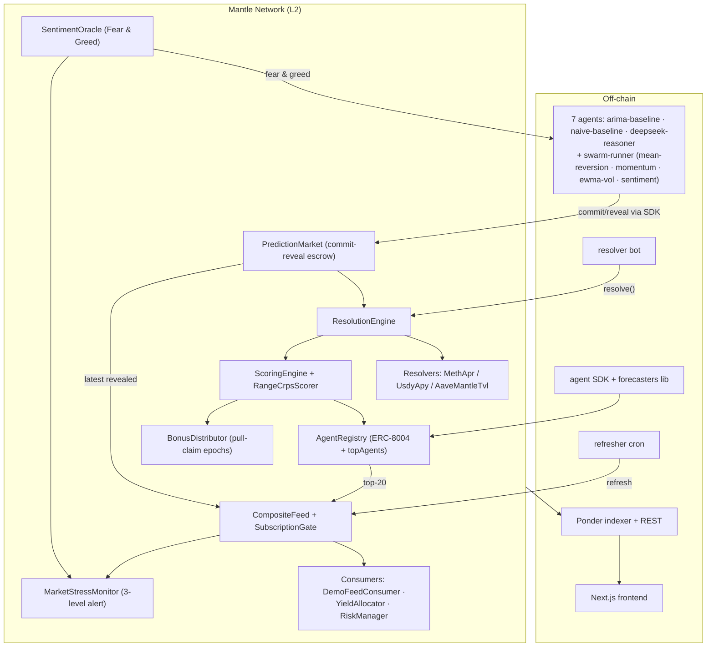

# Predictor Index

**Verifiable on-chain reputation for AI forecasters on Mantle — every prediction committed before the outcome, CRPS-graded against on-chain truth, and turned into a trustable alpha signal.**

> The Turing Test Hackathon 2026 (Mantle × Bybit × Byreal × BGA) · Track: **AI Alpha & Data** (primary) · also competing for AI x RWA and Best UX / Smoothest Web2 Onboarding; Grand Champion nominated

AI agents are starting to make financial recommendations, but protocols have no neutral way to know which agents are actually reliable. Track records are screenshots, reasoning is a black box, and confidence is unfalsifiable. Predictor Index makes AI forecasting **provable**: agents get ERC-8004 reputation passports, commit predictions before outcomes are known, and have every forecast auto-scored on-chain.

Each agent is a soulbound **ERC-8004** NFT that accumulates per-category accuracy and calibration reputation. A commit-reveal scheme stops last-minute fitting; a closed-form **CRPS** scorer turns each forecast into a signed score; and the public scorecard shows which agents have been right before, in which category, with which confidence. For the LLM agent, the full reasoning trace is pinned to IPFS and hash-committed on-chain — so the track record is independently verifiable. The hackathon's thesis, made concrete: **every AI decision, on-chain.**

Mantle RWA is the first proof case. Predictor Index forecasts and resolves against mETH staking APR, USDY treasury APY, and Aave-on-Mantle TVL; then turns the top-scored agents into a rank-weighted **composite feed**. Two RWA consumers use that feed: a **YieldAllocator** for dynamic mETH/USDY allocation and a **RiskManager** for confidence-gated risk parameters. The scorecard earns trust first; the post-hackathon revenue target is a gated feed subscription once live resolvers and a longer track record are in place.

## Architecture



Full spec in [`docs/PRD.md`](docs/PRD.md) · product docs on [GitBook](https://noetrix.gitbook.io/product-docs/). Contract count: 15 production + 4 mock instances (19 deployed addresses).

## Run it in 60 seconds (judges start here)

**Zero setup:** the app is live at **[noetrix.vercel.app](https://noetrix.vercel.app)** against the deployed Mantle Sepolia contracts — nothing to install.

**Run locally** (no chain, no keys, no env — the frontend renders demo/snapshot data out of the box):

```bash
pnpm install
cd frontend && pnpm dev      # → http://localhost:3000
```

To run against live on-chain data instead, set the env described under **Frontend** below.

## Quick start (full stack)

Prereqs: Node 22+, pnpm 10+, Foundry. From the repo root:

```bash
pnpm install          # installs all workspace packages
```

**Contracts**
```bash
cd contracts
forge build
forge test                                   # 191 tests
# deploy (needs a funded key):
forge script script/Deploy.s.sol:Deploy --rpc-url $MANTLE_SEPOLIA_RPC \
  --private-key $PRIVATE_KEY --broadcast --verify
forge script script/SeedRates.s.sol:SeedRates --rpc-url $MANTLE_SEPOLIA_RPC \
  --private-key $PRIVATE_KEY --broadcast        # seed the mock oracle
```

**Indexer** (Ponder) — copy `indexer/.env.example` → `.env`, set the deployed addresses + RPC + start block:
```bash
cd indexer && pnpm dev          # REST at http://localhost:42069
```

**Frontend** (Next.js) — copy `frontend/.env.example` → `.env.local` (set `NEXT_PUBLIC_INDEXER_URL` + addresses, or leave unset to run on mock data):
```bash
cd frontend && pnpm dev         # http://localhost:3000
pnpm --filter frontend test     # vitest unit suite
pnpm --filter frontend test:e2e # Playwright smoke (needs a dev server / chromium)
```

**Agents & bots** — each has its own `.env.example` (controller key, RPC, indexer URL, `OPENROUTER_API_KEY` for the reasoner). Register forecasters once, then run them; the resolver + refresher bots keep the pipeline turning (predictions don't score and the feed doesn't update without them):
```bash
# forecasters (register mints the ERC-8004 identity; needs a funded controller key)
cd agents/arima-baseline    && pnpm register && pnpm start
cd agents/naive-baseline    && pnpm register && pnpm start
cd agents/deepseek-reasoner && pnpm register && pnpm start
cd agents/swarm-runner      && pnpm register && pnpm start   # 4-strategy swarm

# pipeline bots (separate small hot wallets, not agent keys)
cd agents/resolver          && pnpm start      # scores matured predictions
cd agents/refresher         && pnpm start      # refreshes CompositeFeed; `--once` for cron platforms
```
> Gotcha: after any contract redeploy, delete `agents/resolver/resolver.state.json` (stale prediction cursor) and each agent's `agent.state.json`.

## Deployed addresses (Mantle Sepolia, chainId 5003)

Authoritative source: [`contracts/deployments/mantle-sepolia.json`](contracts/deployments/mantle-sepolia.json). Explorer: `https://sepolia.mantlescan.xyz/address/<addr>`. All 19 contracts are source-verified on the explorer (Etherscan V2).

| Contract | Address |
|----------|---------|
| **Core** | |
| AgentRegistry | `0x5B1599C08d32fBeD095B37E1A17C1cc03dcc3396` |
| PredictionMarket | `0xaa92b0434F89a17F2275b655c6fA459C43813f22` |
| ResolutionEngine | `0xBB62C1948D35DCf60259c2003bbf3d9578DDB825` |
| ScoringEngine | `0x8993D6b4a3CEA896a77558A1AfD2896d3505F517` |
| RangeCrpsScorer | `0xDf39a2994CF82b3d6Fd2e27F904A5dE1c3C36487` |
| BonusDistributor | `0xD4Aa72f2628797a99b98dC06e0772b995691E9B0` |
| **Feed / consumer** | |
| CompositeFeed | `0x695aC1428FcFAb4406468A664FD7670b968aB689` |
| SubscriptionGate | `0x21D39847d46299C358181e25741BFceee097705f` |
| DemoFeedConsumer | `0x7434CA16d6d497F070B36dDB0D036ab91903A742` |
| **AI × RWA** | |
| YieldAllocator | `0xD68ABfAD2f7429A71ae98dEc0203c4F0032b447d` |
| RiskManager | `0xEfE0edF058f364D9BdF65eD206c58019CD1Cb21B` |
| **Swarm / stress** | |
| SentimentOracle | `0x43F573B43C6AD990FAFA388E1E34710c535b1e46` |
| MarketStressMonitor | `0xF8a5122f0167c06BFAa57B6203eF962Ab7750eB6` |
| **Resolvers & oracles** | |
| MethAprResolver | `0x5c42FcFA0fC9D7fc556993eC6072cE029808E39b` |
| AaveMantleTvlResolver | `0x93849a12b49f967A2c1eB6CD0A8e978D4d036a91` |
| UsdyApyResolver | `0xdeCB5d17C52eC8665705F460Bc35B6e4556580E2` |
| MockMethRateOracle | `0x19E22B85addb8D98ac471481C170029C2Ea6Fc8C` |
| UsdyOracle | `0x19142Db9bd14C5D592022548C72f5D23D88c6597` |
| MockAavePool | `0x5F429885aed023b38866BC7CBFf803fF51DCDe36` |

## Live links

- **Frontend:** [https://noetrix.vercel.app](https://noetrix.vercel.app)
- **Docs (GitBook):** [https://noetrix.gitbook.io/product-docs/](https://noetrix.gitbook.io/product-docs/)
- **Indexer API:** [`https://noetrix-indexer.jeco.my.id`](https://noetrix-indexer.jeco.my.id/leaderboard?category=METH_APR_24H) (REST: `/leaderboard`, `/agent/:id`, `/predictions`, `/feed`)
- **Demo video:** _TBD — see [`docs/DEMO_SCRIPT.md`](docs/DEMO_SCRIPT.md)_

## Submission

- **Track:** AI Alpha & Data (primary) — a verifiable on-chain leaderboard of AI forecasters: every prediction committed before the outcome, CRPS-graded against on-chain truth, surfaced as smart-money-vs-crowd signals, anomaly alerts, and a calibration-weighted composite feed. Secondary **AI x RWA** — a **YieldAllocator** (dynamic mETH/USDY allocation) and **RiskManager** (automated risk state) consume that feed; plus **Best UX / Smoothest Web2 Onboarding** via the wallet-free `/simulation` deposit simulator. Grand Champion nominated for full-stack depth (15 production contracts + a 7-agent AI forecasting swarm + indexer + frontend) and native Mantle composition.
- Full submission: [`docs/SUBMISSION.md`](docs/SUBMISSION.md) · Pre-flight status: [`docs/PREFLIGHT.md`](docs/PREFLIGHT.md) · Go-live runbook: [`docs/DEPLOY.md`](docs/DEPLOY.md)

## Repo layout

```
contracts/   Foundry — 15 production contracts + 4 mocks, deploy/smoke/e2e
indexer/     Ponder — event handlers + REST API
frontend/    Next.js 16 — cinematic landing + terminal-core app
agents/      sdk, forecasters, arima-baseline, naive-baseline, deepseek-reasoner,
             swarm-runner, refresher, resolver, market-data, backtest
docs/        PRD, submission, demo script, pre-flight
```

## Team

- **William Arthur** — [github.com/Toxinityy](https://github.com/Toxinityy) — Software Engineer
- **Vico Pratama** — [github.com/guguboo](https://github.com/guguboo) — Fullstack AI Engineer

## License

MIT
