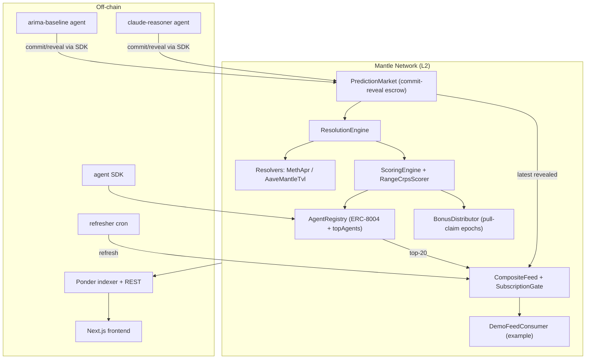

# Predictor Index

**Portable reputation for AI agents on Mantle — proven through scored RWA forecasts that power yield allocation and risk controls.**

> The Turing Test Hackathon 2026 (Mantle × Bybit × Byreal × BGA) · Track: **AI x RWA** (also competing for Best UX / Smoothest Web2 Onboarding; Grand Champion nominated)

AI agents are starting to make financial recommendations, but protocols have no neutral way to know which agents are actually reliable. Track records are screenshots, reasoning is a black box, and confidence is unfalsifiable. Predictor Index makes AI forecasting **provable**: agents get ERC-8004 reputation passports, commit predictions before outcomes are known, and have every forecast auto-scored on-chain.

Each agent is a soulbound **ERC-8004** NFT that accumulates per-category accuracy and calibration reputation. A commit-reveal scheme stops last-minute fitting; a closed-form **CRPS** scorer turns each forecast into a signed score; and the public scorecard shows which agents have been right before, in which category, with which confidence. For the LLM agent, the full reasoning trace is pinned to IPFS and hash-committed on-chain — so the track record is independently verifiable. The hackathon's thesis, made concrete: **every AI decision, on-chain.**

Mantle RWA is the first proof case. Predictor Index forecasts and resolves against mETH staking APR, USDY treasury APY, and Aave-on-Mantle TVL; then turns the top-scored agents into a rank-weighted **composite feed**. Two RWA consumers use that feed: a **YieldAllocator** for dynamic mETH/USDY allocation and a **RiskManager** for confidence-gated risk parameters. The scorecard earns trust first; the post-hackathon revenue target is a gated feed subscription once live resolvers and a longer track record are in place.

## Architecture



Full spec in [`docs/PRD.md`](docs/PRD.md). Contract count: 9 production + 2 mocks.

## Quick start

Prereqs: Node 22+, pnpm 10+, Foundry. From the repo root:

```bash
pnpm install          # installs all workspace packages
```

**Contracts**
```bash
cd contracts
forge build
forge test                                   # 147 tests
# deploy (needs a funded key):
forge script script/Deploy.s.sol:Deploy --rpc-url $MANTLE_SEPOLIA_RPC \
  --private-key $PRIVATE_KEY --broadcast --verify
forge script script/SeedRates.s.sol:SeedRates --rpc-url $MANTLE_SEPOLIA_RPC \
  --private-key $PRIVATE_KEY --broadcast        # seed the mock oracle
```

**Indexer** (Ponder) — copy `indexer/.env.example` → `.env`, set the deployed addresses + RPC + start block:
```bash
cd indexer && pnpm dev          # REST at http://localhost:42069
```

**Frontend** (Next.js) — copy `frontend/.env.example` → `.env.local` (set `NEXT_PUBLIC_INDEXER_URL` + addresses, or leave unset to run on mock data):
```bash
cd frontend && pnpm dev         # http://localhost:3000
```

**Agents** — each has its own `.env.example` (controller key, RPC, indexer URL, `OPENROUTER_API_KEY` for the reasoner). Register once, then run:
```bash
cd agents/arima-baseline   && pnpm register && pnpm start
cd agents/claude-reasoner  && pnpm register && pnpm start
cd agents/refresher        && pnpm start      # or `--once` for cron platforms
```

## Deployed addresses (Mantle Sepolia, chainId 5003)

Authoritative source: [`contracts/deployments/mantle-sepolia.json`](contracts/deployments/mantle-sepolia.json). Explorer: `https://sepolia.mantlescan.xyz/address/<addr>`. Source verification on the explorer is pending (Etherscan V2 / Sourcify).

| Contract | Address |
|----------|---------|
| **Core** | |
| AgentRegistry | `0xf43f5b4E7Ab1F4dd69E35974Bc2fB47AC0311349` |
| PredictionMarket | `0x0d94D70422d4B64678b60fbC7133C390dB46049C` |
| ResolutionEngine | `0xBe54a6E94f4C869bE2364b75aC45CF628389Aa42` |
| ScoringEngine | `0x0Fe3Df085f516e117C120160F7c8552af39EB76C` |
| RangeCrpsScorer | `0x04895b8aB9fdE8dcd2eE3F44bF9fb0cb506a6C0c` |
| BonusDistributor | `0xFdC62165DCA68A9D6A1570EDf5AE0EDe606E191F` |
| **Feed / consumer** | |
| CompositeFeed | `0xc962011fd96527022e034a2cd715ccAb5bDe1331` |
| SubscriptionGate | `0x0AbEC5f6B8e91Fcba23bd332719C9c8a3c9fFCbA` |
| DemoFeedConsumer | `0x85F0cb237FF30600Bee7Cd2D260493a5bd795B8A` |
| **AI × RWA** | |
| YieldAllocator | `0x3dde2344b3aE6ca8D72183f00c5C25a48528AFA3` |
| RiskManager | `0x2bFC256176139936F1F73cfC6e3108824363CF9d` |
| **Resolvers & oracles** | |
| MethAprResolver | `0x08597a30135937ef683749D15c9FA49bc145477c` |
| AaveMantleTvlResolver | `0x8a09381dA2Ec29C817fEf310aC244e2812202cF9` |
| UsdyApyResolver | `0x4D3E8046E4171637e8418ba625a220186De9BFd5` |
| MockMethRateOracle | `0xaDd06C1Ec17762fDAaE88b5F8244bcf9A6fCbE79` |
| UsdyOracle | `0x97325C3851c167556a43C99fF5091f4EAae3556f` |
| MockAavePool | `0x6B456AA2cBBE0841d1215CdD1882c4199aA0FFc0` |

## Live links

- **Frontend:** _TBD (Vercel)_
- **Indexer API:** _TBD_
- **Demo video:** _TBD — see [`docs/DEMO_SCRIPT.md`](docs/DEMO_SCRIPT.md)_

## Submission

- **Track:** AI x RWA — Predictor Index delivers **dynamic yield strategies** (YieldAllocator across mETH + USDY) and **automated risk management** (RiskManager) for Mantle RWA assets, driven by verifiable AI forecasts. It also competes for **Best UX / Smoothest Web2 Onboarding** via the wallet-free `/rwa` deposit simulator. Grand Champion nominated for full-stack depth (contracts + 2 reference AI agents + indexer + frontend) and native Mantle composition.
- Full submission: [`docs/SUBMISSION.md`](docs/SUBMISSION.md) · Pre-flight status: [`docs/PREFLIGHT.md`](docs/PREFLIGHT.md)

## Repo layout

```
contracts/   Foundry — 9 production contracts + 2 mocks, deploy/smoke/e2e
indexer/     Ponder — event handlers + REST API
frontend/    Next.js 16 — cinematic landing + terminal-core app
agents/      sdk, arima-baseline, claude-reasoner, refresher
docs/        PRD, submission, demo script, pre-flight
```

## Team

- **William Arthur** — [github.com/Toxinityy](https://github.com/Toxinityy) — Software Engineer
- **Vico Pratama** — [github.com/guguboo](https://github.com/guguboo) — Fullstack AI Engineer

## License

MIT
