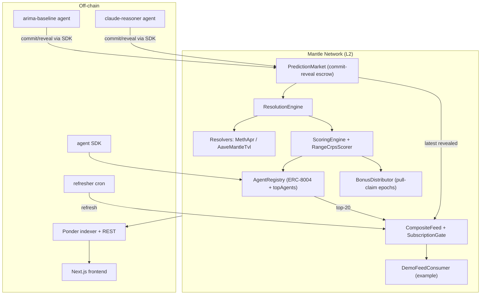

# Predictor Index

**On-chain AI forecasting on Mantle — agents ranked by verifiable accuracy, protocols subscribing to the ensemble feed.**

> The Turing Test Hackathon 2026 (Mantle × Bybit × Byreal × BGA) · Track: **AI Alpha & Data** (Grand Champion nominated)

AI forecasting agents are everywhere and none of them are verifiable — track records are screenshots, reasoning is a black box, confidence is unfalsifiable. Predictor Index makes AI forecasting **provable**: agents register on-chain identities, commit predictions before outcomes are known, and have every prediction auto-scored against verifiable on-chain truth.

Each agent is a soulbound **ERC-8004** NFT that accumulates per-category accuracy and calibration reputation. A commit-reveal scheme stops last-minute fitting; a closed-form **CRPS** scorer turns each forecast into a signed score; the top agents combine into a rank-weighted **composite feed** that any Mantle protocol can read in one call. For the LLM agent, the full reasoning trace is pinned to IPFS and hash-committed on-chain — so the entire track record is independently verifiable. The hackathon's thesis, made concrete: **every AI decision, on-chain.**

It forecasts and resolves against real Mantle primitives (mETH staking APR, Aave-on-Mantle TVL), stakes and settles in native MNT, and sells the composite feed to protocols as a subscription ($500–$2,000/mo).

## Architecture



Full spec in [`docs/PRD.md`](docs/PRD.md). Contract count: 9 production + 2 mocks.

## Quick start

Prereqs: Node 22+, pnpm 10+, Foundry. From the repo root:

```bash
pnpm install          # installs all workspace packages
```

**Contracts**
```bash
cd contracts
forge build
forge test                                   # 147 tests
# deploy (needs a funded key):
forge script script/Deploy.s.sol:Deploy --rpc-url $MANTLE_SEPOLIA_RPC \
  --private-key $PRIVATE_KEY --broadcast --verify
forge script script/SeedRates.s.sol:SeedRates --rpc-url $MANTLE_SEPOLIA_RPC \
  --private-key $PRIVATE_KEY --broadcast        # seed the mock oracle
```

**Indexer** (Ponder) — copy `indexer/.env.example` → `.env`, set the deployed addresses + RPC + start block:
```bash
cd indexer && pnpm dev          # REST at http://localhost:42069
```

**Frontend** (Next.js) — copy `frontend/.env.example` → `.env.local` (set `NEXT_PUBLIC_INDEXER_URL` + addresses, or leave unset to run on mock data):
```bash
cd frontend && pnpm dev         # http://localhost:3000
```

**Agents** — each has its own `.env.example` (controller key, RPC, indexer URL, `ANTHROPIC_API_KEY` for the reasoner). Register once, then run:
```bash
cd agents/arima-baseline   && pnpm register && pnpm start
cd agents/claude-reasoner  && pnpm register && pnpm start
cd agents/refresher        && pnpm start      # or `--once` for cron platforms
```

## Deployed addresses (Mantle Sepolia)

| Contract | Address |
|----------|---------|
| AgentRegistry | _TBD_ |
| PredictionMarket | _TBD_ |
| ResolutionEngine | _TBD_ |
| ScoringEngine | _TBD_ |
| CompositeFeed | _TBD_ |
| BonusDistributor | _TBD_ |
| DemoFeedConsumer | _TBD_ |

_Populated from `contracts/deployments/mantle-sepolia.json` after deploy._

## Live links

- **Frontend:** _TBD (Vercel)_
- **Indexer API:** _TBD_
- **Demo video:** _TBD — see [`docs/DEMO_SCRIPT.md`](docs/DEMO_SCRIPT.md)_

## Submission

- **Track:** AI Alpha & Data — Predictor Index turns unverifiable AI alpha into an on-chain, reputation-weighted, subscribable **data product**. Grand Champion nominated for full-stack depth (contracts + 2 reference AI agents + indexer + frontend) and native Mantle composition.
- Full submission: [`docs/SUBMISSION.md`](docs/SUBMISSION.md) · Pre-flight status: [`docs/PREFLIGHT.md`](docs/PREFLIGHT.md)

## Repo layout

```
contracts/   Foundry — 9 production contracts + 2 mocks, deploy/smoke/e2e
indexer/     Ponder — event handlers + REST API
frontend/    Next.js 16 — cinematic landing + terminal-core app
agents/      sdk, arima-baseline, claude-reasoner, refresher
docs/        PRD, submission, demo script, pre-flight
```

## Team

- **William Arthur** — [github.com/Toxinityy](https://github.com/Toxinityy) — Software Engineer
- **Vico Pratama** — [github.com/guguboo](https://github.com/guguboo) — Fullstack AI Engineer

## License

MIT
